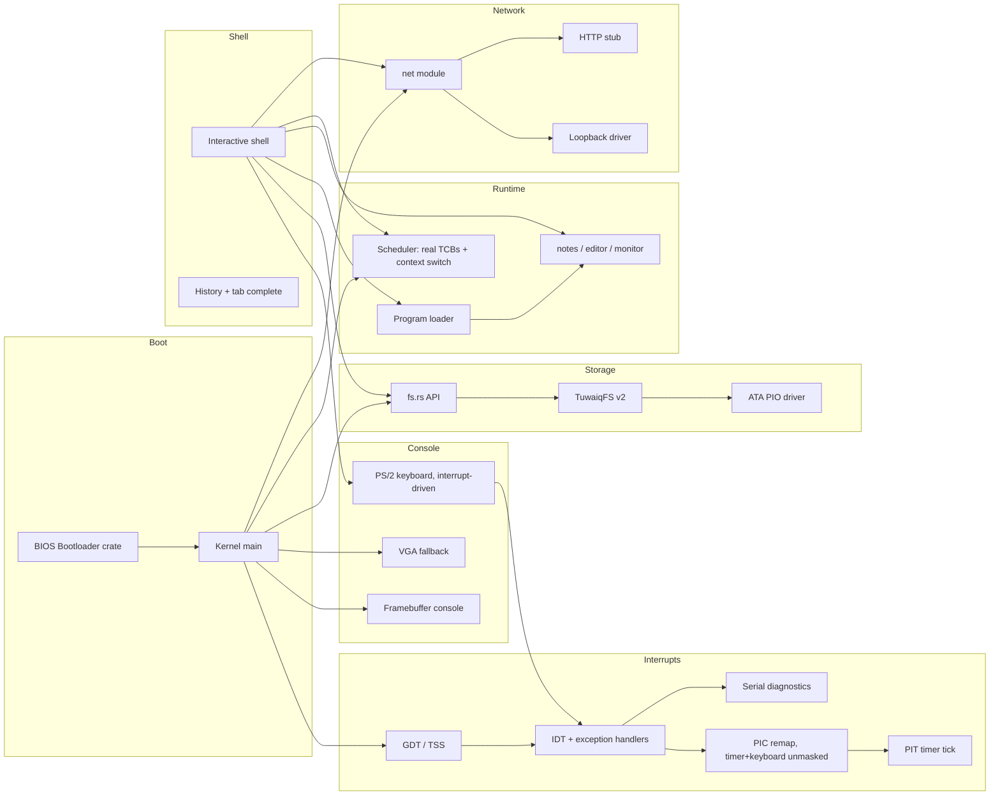

# TuwaiqOS Architecture

## Overview

TuwaiqOS is a monolithic bare-metal kernel written in Rust (`no_std`). All services run in kernel mode today; user-mode separation is planned for v0.7.

## Boot sequence

1. `bootloader` crate loads the kernel ELF from the BIOS disk image.
2. `kernel_main` initializes the heap, then interrupts (GDT/TSS, IDT,
   PIC remap + mask, PIT timer, `sti`), then ATA, TuwaiqFS, tasks, and
   network.
3. Framebuffer or VGA console starts; shell prints boot banner and prompt.

Interrupts must come immediately after the heap: the keyboard event queue
(`keyboard.rs`) allocates, and everything after this point in boot
(`ata::read_sector` polling loops in particular) runs with real hardware
interrupts live rather than a purely polled CPU.

## Kernel modules

| Module | Role |
|--------|------|
| `main.rs` | Entry point, subsystem init order |
| `serial.rs` | COM1 UART -- boot log and panic diagnostics, works headless |
| `gdt.rs` | GDT, TSS, dedicated IST stacks for double-fault and the keyboard IRQ |
| `interrupts.rs` | IDT, exception handlers, PIC remap/mask, PIT tick, `uptime` |
| `memory.rs` / `allocator.rs` | 4 MiB paged heap, `GlobalAlloc` |
| `paging.rs` | Frame allocator, `OffsetPageTable`, error-returning page mapping |
| `keyboard.rs` | Interrupt-driven PS/2 Set-1 scancodes, Shift, arrows, Tab |
| `framebuffer_console.rs` | Scaled 8×8 font on bootloader FB |
| `vga_buffer.rs` | 80×25 text mode fallback |
| `shell.rs` | Command loop, history, completion |
| `fs.rs` | In-memory tree API for shell |
| `tuwaiqfs.rs` | On-disk serialization (TuwaiqFS v2) |
| `ata.rs` | Primary master PIO sector I/O |
| `task.rs` | Preemptive scheduler: real TCBs, per-task stacks, context switch |
| `loader.rs` / `programs/` | Built-in program registry |
| `apps/` | notes, editor, monitor |
| `net/` | Driver trait, loopback, HTTP stub |
| `ai_bridge.rs` | Offline AI stub for future gateway |
| `reboot.rs` | Sync FS + keyboard controller reset |

## Interrupts (GDT / IDT / PIC / PIT)

- **GDT/TSS** (`gdt.rs`): a minimal GDT (null, kernel code, TSS) plus two
  dedicated Interrupt Stack Table entries -- one for `#DF` (double fault),
  one for the keyboard IRQ, which never redirects control flow so a fixed
  stack is safe for it. The timer IRQ deliberately does **not** use an IST
  stack (see Scheduler below): as of Phase 3 it may perform a real context
  switch, which only works if the interrupt frame lands on *the currently
  running task's own stack* rather than a fixed physical one shared by
  every tick regardless of which task was running.
  Loading a new GDT does **not** reload `SS`/`DS`/`ES`/`FS`/`GS` -- the
  bootloader's own (now-stale) selector values are explicitly reloaded to
  null here, which is load-bearing: skipping it produces a GPF on every
  single interrupt return, since `iretq` validates the stacked `SS`
  selector against the *current* GDT.
- **IDT** (`interrupts.rs`): handlers for breakpoint, double fault, page
  fault, general-protection fault, invalid opcode, and divide error, each
  logging full diagnostics over serial (and to the framebuffer console if
  it's confirmed active) before halting. A software breakpoint self-test
  runs immediately after the IDT loads, before any hardware interrupt is
  permitted to fire.
- **PIC remap**: legacy IRQs 0-15 are remapped to vectors 32-47. Only
  IRQ0 (timer) and IRQ1 (keyboard) are left unmasked -- `ChainedPics::initialize()`
  preserves whatever mask the BIOS left rather than resetting it, and
  SeaBIOS leaves several lines (IRQ14, the primary ATA/IDE controller,
  among them) unmasked by default. A hardware IRQ landing on any other,
  not-present vector is exactly what caused a double fault during bring-up.
- **PIT**: channel 0 programmed for a 100 Hz square-wave interrupt, driving
  a tick counter (`interrupts::ticks()` / `uptime_seconds()`) and letting
  the shell's input loop `hlt` between keystrokes instead of busy-spinning.
- **Keyboard**: scancodes now arrive via IRQ1 and are decoded inside the
  ISR into a locked queue; `keyboard::poll_key()` keeps its original
  signature (drain-or-`None`), so `shell.rs` needed no changes beyond
  halting instead of spinning on `None`.

## TuwaiqFS v2

See [docs/TUWAIQFS.md](docs/TUWAIQFS.md). The full directory tree is flattened to path records (`hello.txt`, `docs/readme.txt`) and stored in a metadata region starting at LBA 8465.

## Program loader

`loader.rs` dispatches `run <name>` to built-in programs in `programs/`. The registry pattern is designed so an ELF loader can replace the dispatch table later without changing shell parsing.

## Shell

- Prompt: `tuwaiq@os:~$` at root, `tuwaiq@os:/path$` elsewhere
- History: 16 entries, Up/Down recall
- Tab: completes commands, program names, and file names
- `clear`/`cls`: full screen wipe via framebuffer or VGA

## Memory model

- Stack: kernel stack provided by bootloader, plus two dedicated IST
  stacks installed via the TSS (double fault, and the keyboard IRQ only --
  the timer IRQ deliberately does **not** use IST as of Phase 3; see
  Scheduler below)
- Heap: 4 MiB of real virtual memory at a fixed address (`0x_4444_4444_0000`),
  backed by physical frames mapped in on demand -- not a static array
  anymore (see Paging below). Falls back to an equivalent-size static
  array if the bootloader ever fails to provide a physical memory offset,
  so a paging setup problem degrades the heap rather than failing to boot.
- The bootloader's own page tables do **not** map the legacy VGA text
  buffer (0xB8000) in this project's boot configuration -- writing to it
  from a fault/panic path will page-fault, which is why fault reporting
  only touches the framebuffer console (see `interrupts::report_fault`)

## Paging (Phase 2)

- **Physical memory access**: `main.rs` opts into the bootloader mapping
  *all* physical memory at a dynamic virtual offset
  (`BootloaderConfig.mappings.physical_memory = Some(Mapping::Dynamic)`).
  Without this, `boot_info.physical_memory_offset` is `None` and no
  physical address is dereferenceable at all -- this is exactly why v0.5's
  heap was a static array instead.
- **Frame allocator** (`paging::BootInfoFrameAllocator`): bump-allocates
  4 KiB frames from the bootloader's `Usable` memory regions. Freed frames
  go onto a small pool and are reused before the bump cursor advances --
  a real allocator with working deallocation, not a stub that only ever
  hands out memory.
- **Mapper**: `paging::init` builds an `x86_64::structures::paging::OffsetPageTable`
  over the CPU's active level-4 table (read from `CR3`, translated to a
  virtual address via the physical memory offset above).
  `paging::map_page` wraps `Mapper::map_to` to return a `Result` instead
  of panicking on failure (out of frames, or the page is already mapped).
- **Heap**: `memory::init_heap` maps `HEAP_SIZE` worth of pages at
  `HEAP_START` with `PRESENT | WRITABLE`, then hands that range to the
  same `linked_list_allocator` as before -- `allocator.rs`'s public API
  didn't need to change, only what `init_heap` passes it did.
- **Diagnostics**: `sysinfo` and `monitor` show heap used/free bytes
  (`allocator::used()`/`free()`) and frame allocator stats
  (`paging::frame_stats()`) -- real numbers read from the live allocator
  state, not placeholders.
- **Global state**: the installed mapper and frame allocator live behind
  `spin::Mutex`, not a bare `static mut` -- Phase 3's scheduler is what
  will make them genuinely reachable from more than one execution context,
  and this is deliberately already safe for that before it exists.
- **Still missing** (tracked for later phases): per-process address
  spaces, unmapping/guard pages for anything other than the heap, and
  swapping/paging to disk. This phase gives the kernel real physical
  memory management and a heap that uses it -- it does not yet give
  user-mode processes isolated memory (Phase 4).

## Scheduler (Phase 3)

`task.rs` replaces the old two-row decorative task table with a real
preemptive scheduler: `ps`/`taskinfo`/`kill` now report and act on genuine
execution state, not bookkeeping strings.

- **Task control block**: each task has its own heap-allocated 32 KiB
  stack (the boot task, id 1 "shell", is the one exception -- it runs on
  the stack the bootloader handed the kernel), a saved stack pointer, and
  a `Ready`/`Running`/`Blocked`/`Terminated` state.
- **Context switch**: `context_switch(old_rsp, new_rsp)` is hand-written
  assembly that looks like an ordinary `extern "C"` call from the Rust
  side, and that's the whole trick -- the System V calling convention
  already specifies that a normal call must preserve `rbx`/`rbp`/`r12`-`r15`
  and the stack pointer, and may clobber everything else (there are no
  callee-saved XMM registers in SysV at all). Saving exactly that set
  before switching `rsp` to a different task's stack, then restoring it
  and `ret`-ing, is a fully correct function call from the compiler's
  point of view; the "magic" is entirely in whose stack the `ret` address
  came from. See `task.rs`'s module docs for the complete walkthrough.
- **Why the timer interrupt no longer uses an IST stack**: a suspended
  task's entire call chain -- including the CPU-pushed interrupt frame --
  has to sit dormant on *that task's own stack* between switches, or
  there's nothing correct to resume later. An IST stack would force every
  timer tick onto the same fixed physical stack regardless of which task
  was running, destroying that. Keyboard keeps its IST stack: it never
  redirects control flow, so this doesn't apply to it.
- **Preemption**: `task::on_timer_tick` (called from the timer ISR) wakes
  any `Blocked` task whose sleep has elapsed, then preempts into the
  scheduler every 5 ticks (50 ms at the PIT's 100 Hz rate).
- **Primitives**: `spawn`, `yield_now` (also a shell command, `yield`),
  `sleep_ticks`, `exit`. A fresh task's first-ever entry runs through a
  small trampoline that explicitly re-enables interrupts (`sti`) before
  calling it -- a *resumed* task's interrupt-enable state is already
  correct via its own dormant call chain, but a brand new one has no such
  chain to inherit it from.
- **Demonstration**: a `heartbeat` task (id 3) is spawned at boot; it
  sleeps ~1 second and logs a beat count over serial, forever. Watching
  its count climb steadily in the serial log while the shell stays
  interactively responsive -- and while `kill 3` genuinely stops it, not
  just relabels it -- is the verification this phase's own engineering
  rules require before it counts as done, not just a clean compile.

## Locking invariant

Introducing real preemption in Phase 3 turned every lock the kernel takes
into a potential deadlock site, and two independent-review passes each
found a real instance before this invariant was made explicit and
enforced everywhere. Both are worth understanding together, because they
are the same underlying mistake made twice:

**The invariant: any lock that could be held by code the timer interrupt
might preempt must be held with interrupts disabled for its *entire*
critical section -- acquisition through release, no exceptions.** On a
single-core kernel this is exactly sufficient: "interrupts disabled"
*is* "cannot be preempted", so a task can never be switched away from
mid-critical-section, which means no other task can ever observe that
lock as held-by-someone-who-isn't-running-and-never-will-be-again.

- **Bug 1 -- `SCHEDULER` itself.** `task::init`/`spawn`/`list`/`info`/`kill`
  originally called `SCHEDULER.lock()` directly, with interrupts enabled.
  The timer ISR's `on_timer_tick` also locks `SCHEDULER`. A tick landing
  while any of those five held the lock deadlocked permanently. Fixed by
  `task::with_scheduler`, the single sanctioned access point -- every
  caller goes through it, so a future call site cannot reintroduce this
  by forgetting to wrap a lock acquisition by hand.
- **Bug 2 -- the heap allocator, reachable *through* the first fix.**
  Making `with_scheduler` interrupt-safe doesn't help if code running
  *inside* it can still be preempted some other way -- and it can:
  `list`/`info` clone `String`s and `spawn` pushes to a `Vec`, all of
  which allocate, and `linked_list_allocator::LockedHeap` (behind
  `#[global_allocator]`) used a plain, interrupt-oblivious spinlock. A
  task holding that lock during perfectly ordinary allocation (which
  doesn't disable interrupts anywhere else in the kernel either) could
  be preempted by the timer; if the task switched to then tried to
  allocate -- entirely possible inside `with_scheduler`'s own already
  interrupt-disabled section -- it would spin on the heap lock forever,
  and no timer tick could ever fire to let the true owner resume and
  release it. Fixed in `allocator.rs`: `InterruptSafeHeap` wraps every
  acquisition of the heap's lock (allocation, deallocation, `init`,
  `used`, `free`) in `without_interrupts`, the same
  `spin_lock_irqsave`-style pattern used elsewhere. This is the general
  fix -- it protects *any* code that allocates while interrupts happen to
  be off, not just the scheduler's current three call sites.
- **Bug 3 -- `keyboard::QUEUE`, found proactively while auditing for the
  same pattern.** `keyboard::push` (called from the keyboard ISR) and
  `keyboard::poll_key` (called from the shell in ordinary, interrupt-enabled
  context) locked the same queue without interrupt protection. A keyboard
  IRQ landing at the exact instant `poll_key` held the lock would deadlock
  the same way: `on_scancode`'s own lock attempt inside the ISR spins
  forever waiting for a release that can only happen once the ISR itself
  returns via `iretq` -- which can't happen until it stops spinning. Fixed
  the same way: `keyboard::with_queue` is now the single access point.
- **Bug 4 -- `paging::MAPPER`/`FRAME_ALLOCATOR`, the last unaudited pair.**
  `paging::install`/`is_active`/`frame_stats` (the latter two reachable
  from `sysinfo`/`monitor`, ordinary shell commands run with interrupts
  enabled) locked these two `spin::Mutex`es directly. Nothing on this
  single-core kernel currently locks them from inside a timer-preempted,
  already-interrupt-disabled section, so this was latent rather than
  demonstrated -- but a future Phase 4 caller (a page fault handler, a
  syscall doing `mmap`-like work) reaching either lock from such a context
  would reproduce Bugs 1-3's exact shape. Fixed the same way, ahead of
  Phase 4 rather than after: `paging::with_paging` is the single access
  point for both locks, acquired together under one `without_interrupts`.

`without_interrupts` (from the `x86_64` crate) nests safely -- it only
disables/restores the flag it personally changed, so `with_scheduler`
calling into code that also calls `with_queue` or `with_paging`, or the
interrupt-safe allocator, composes correctly without double-disabling or
prematurely re-enabling anything.

## Networking

Loopback driver echoes packets in RAM. `ping localhost` validates the stack. HTTP client returns 503 stubs for future AI Bridge integration.

## Build pipeline

1. `cargo build -p kernel --target x86_64-unknown-none`
2. `cargo build -p tuwaiqos` → `build.rs` wraps kernel in BIOS image
3. Output: `boot-bios-tuwaiqos.img`

## Historical note

Earlier versions used AbdullahOS / AbdullahFS v1 (flat root persistence only). TuwaiqOS v0.5 renamed the project and upgraded to TuwaiqFS v2.
