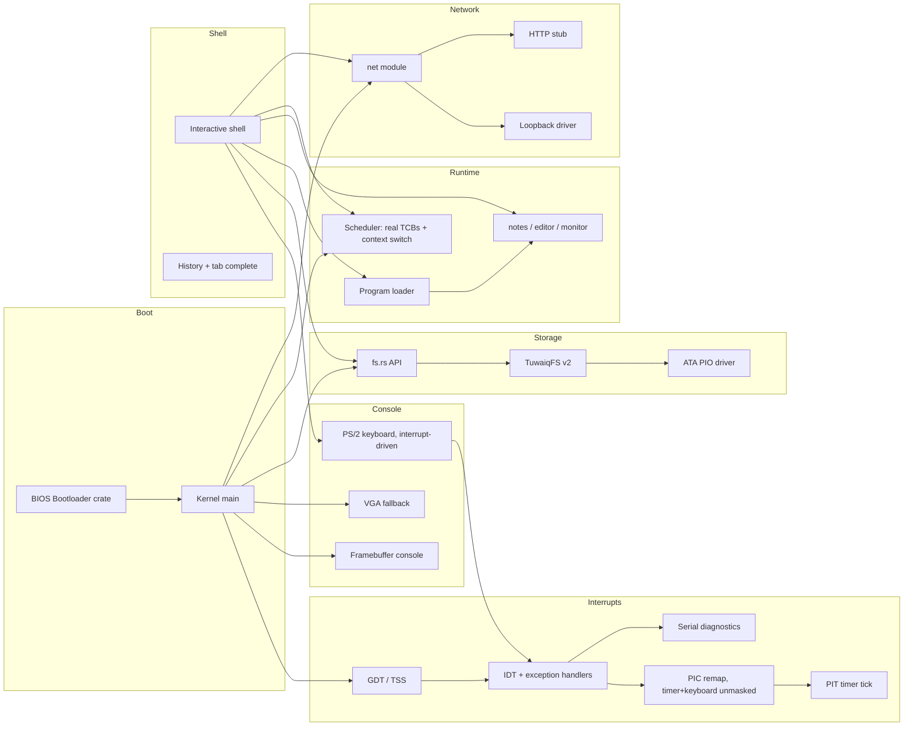

# TuwaiqOS Architecture

## Overview

TuwaiqOS is a monolithic bare-metal kernel written in Rust (`no_std`). All services run in kernel mode today; user-mode separation is planned for v0.7.

## Boot sequence

1. `bootloader` crate loads the kernel ELF from the BIOS disk image.
2. `kernel_main` enables `EFER.NXE` (`paging::enable_nx`, before any page
   table exists -- see Phase 4 below), initializes the heap, then
   interrupts (GDT/TSS, IDT, PIC remap + mask, PIT timer, `sti`), then ATA,
   TuwaiqFS, tasks, and network.
3. Framebuffer or VGA console starts; shell prints boot banner and prompt.

Interrupts must come immediately after the heap: the keyboard event queue
(`keyboard.rs`) allocates, and everything after this point in boot
(`ata::read_sector` polling loops in particular) runs with real hardware
interrupts live rather than a purely polled CPU.

## Kernel modules

| Module | Role |
|--------|------|
| `main.rs` | Entry point, subsystem init order |
| `serial.rs` | COM1 UART -- boot log and panic diagnostics, works headless |
| `gdt.rs` | GDT, TSS, dedicated IST stacks for double-fault and the keyboard IRQ |
| `interrupts.rs` | IDT, exception handlers, PIC remap/mask, PIT tick, `uptime` |
| `memory.rs` / `allocator.rs` | 4 MiB paged heap, `GlobalAlloc` |
| `paging.rs` | Frame allocator, `OffsetPageTable`, error-returning page mapping |
| `keyboard.rs` | Interrupt-driven PS/2 Set-1 scancodes, Shift, arrows, Tab |
| `framebuffer_console.rs` | Scaled 8×8 font on bootloader FB |
| `vga_buffer.rs` | 80×25 text mode fallback |
| `shell.rs` | Command loop, history, completion |
| `fs.rs` | In-memory tree API for shell |
| `tuwaiqfs.rs` | On-disk serialization (TuwaiqFS v2) |
| `ata.rs` | Primary master PIO sector I/O |
| `task.rs` | Preemptive scheduler: real TCBs, per-task stacks, context switch, user-process lifecycle, CR3/RSP0 switching |
| `usermode.rs` | Low-level `iretq` primitive that drops CPL to 3 |
| `elf.rs` | Minimal ELF64 loader: validates and maps `PT_LOAD` segments into a process's address space |
| `syscall.rs` | Real syscall ABI: entry stub, dispatch, user-pointer validation |
| `loader.rs` / `programs/` | Built-in program registry |
| `apps/` | notes, editor, monitor |
| `net/` | Driver trait, loopback, HTTP stub |
| `ai_bridge.rs` | Offline AI stub for future gateway |
| `reboot.rs` | Sync FS + keyboard controller reset |

## Interrupts (GDT / IDT / PIC / PIT)

- **GDT/TSS** (`gdt.rs`): null, kernel code, TSS, and (Phase 4) a Ring 3
  code and data segment, plus two dedicated Interrupt Stack Table entries
  -- one for `#DF` (double fault), one for the keyboard IRQ, which never
  redirects control flow so a fixed stack is safe for it. The timer IRQ
  deliberately does **not** use an IST stack (see Scheduler below): as of
  Phase 3 it may perform a real context switch, which only works if the
  interrupt frame lands on *the currently running task's own stack* rather
  than a fixed physical one shared by every tick regardless of which task
  was running. The TSS is a plain mutable static rather than the
  `lazy_static`-immutable pattern used elsewhere in this file, specifically
  so its RSP0 field can be updated at runtime -- see Ring 3 foundation
  below.
  Loading a new GDT does **not** reload `SS`/`DS`/`ES`/`FS`/`GS` -- the
  bootloader's own (now-stale) selector values are explicitly reloaded to
  null here, which is load-bearing: skipping it produces a GPF on every
  single interrupt return, since `iretq` validates the stacked `SS`
  selector against the *current* GDT.
- **IDT** (`interrupts.rs`): handlers for breakpoint, double fault, page
  fault, general-protection fault, invalid opcode, and divide error, each
  logging full diagnostics over serial (and to the framebuffer console if
  it's confirmed active) before halting. A software breakpoint self-test
  runs immediately after the IDT loads, before any hardware interrupt is
  permitted to fire.
- **PIC remap**: legacy IRQs 0-15 are remapped to vectors 32-47. Only
  IRQ0 (timer) and IRQ1 (keyboard) are left unmasked -- `ChainedPics::initialize()`
  preserves whatever mask the BIOS left rather than resetting it, and
  SeaBIOS leaves several lines (IRQ14, the primary ATA/IDE controller,
  among them) unmasked by default. A hardware IRQ landing on any other,
  not-present vector is exactly what caused a double fault during bring-up.
- **PIT**: channel 0 programmed for a 100 Hz square-wave interrupt, driving
  a tick counter (`interrupts::ticks()` / `uptime_seconds()`) and letting
  the shell's input loop `hlt` between keystrokes instead of busy-spinning.
- **Keyboard**: scancodes now arrive via IRQ1 and are decoded inside the
  ISR into a locked queue; `keyboard::poll_key()` keeps its original
  signature (drain-or-`None`), so `shell.rs` needed no changes beyond
  halting instead of spinning on `None`.

## TuwaiqFS v2

See [docs/TUWAIQFS.md](docs/TUWAIQFS.md). The full directory tree is flattened to path records (`hello.txt`, `docs/readme.txt`) and stored in a metadata region starting at LBA 8465.

## Program loader

`loader.rs` dispatches `run <name>` to built-in programs in `programs/`. The registry pattern is designed so an ELF loader can replace the dispatch table later without changing shell parsing.

## Shell

- Prompt: `tuwaiq@os:~$` at root, `tuwaiq@os:/path$` elsewhere
- History: 16 entries, Up/Down recall
- Tab: completes commands, program names, and file names
- `clear`/`cls`: full screen wipe via framebuffer or VGA

## Memory model

- Stack: kernel stack provided by bootloader, plus two dedicated IST
  stacks installed via the TSS (double fault, and the keyboard IRQ only --
  the timer IRQ deliberately does **not** use IST as of Phase 3; see
  Scheduler below)
- Heap: 4 MiB of real virtual memory at a fixed address (`0x_4444_4444_0000`),
  backed by physical frames mapped in on demand -- not a static array
  anymore (see Paging below). Falls back to an equivalent-size static
  array if the bootloader ever fails to provide a physical memory offset,
  so a paging setup problem degrades the heap rather than failing to boot.
- The bootloader's own page tables do **not** map the legacy VGA text
  buffer (0xB8000) in this project's boot configuration -- writing to it
  from a fault/panic path will page-fault, which is why fault reporting
  only touches the framebuffer console (see `interrupts::report_fault`)
- User processes (Phase 4): own private stack + ELF segments in
  `0x_7000_0000_0000 .. +1 GiB`, own private page-table root -- see the
  Phase 4 section below for the full virtual-memory layout and isolation
  mechanism

## Paging (Phase 2)

- **Physical memory access**: `main.rs` opts into the bootloader mapping
  *all* physical memory at a dynamic virtual offset
  (`BootloaderConfig.mappings.physical_memory = Some(Mapping::Dynamic)`).
  Without this, `boot_info.physical_memory_offset` is `None` and no
  physical address is dereferenceable at all -- this is exactly why v0.5's
  heap was a static array instead.
- **Frame allocator** (`paging::BootInfoFrameAllocator`): bump-allocates
  4 KiB frames from the bootloader's `Usable` memory regions. Freed frames
  go onto a small pool and are reused before the bump cursor advances --
  a real allocator with working deallocation, not a stub that only ever
  hands out memory.
- **Mapper**: `paging::init` builds an `x86_64::structures::paging::OffsetPageTable`
  over the CPU's active level-4 table (read from `CR3`, translated to a
  virtual address via the physical memory offset above).
  `paging::map_page` wraps `Mapper::map_to` to return a `Result` instead
  of panicking on failure (out of frames, or the page is already mapped).
- **Heap**: `memory::init_heap` maps `HEAP_SIZE` worth of pages at
  `HEAP_START` with `PRESENT | WRITABLE`, then hands that range to the
  same `linked_list_allocator` as before -- `allocator.rs`'s public API
  didn't need to change, only what `init_heap` passes it did.
- **Diagnostics**: `sysinfo` and `monitor` show heap used/free bytes
  (`allocator::used()`/`free()`) and frame allocator stats
  (`paging::frame_stats()`) -- real numbers read from the live allocator
  state, not placeholders.
- **Global state**: the installed mapper and frame allocator live behind
  `spin::Mutex`, not a bare `static mut` -- Phase 3's scheduler is what
  will make them genuinely reachable from more than one execution context,
  and this is deliberately already safe for that before it exists.
- **Still missing** (tracked for later phases): per-process address
  spaces, unmapping/guard pages for anything other than the heap, and
  swapping/paging to disk. This phase gives the kernel real physical
  memory management and a heap that uses it -- it does not yet give
  user-mode processes isolated memory (Phase 4).

## Scheduler (Phase 3)

`task.rs` replaces the old two-row decorative task table with a real
preemptive scheduler: `ps`/`taskinfo`/`kill` now report and act on genuine
execution state, not bookkeeping strings.

- **Task control block**: each task has its own heap-allocated 32 KiB
  stack (the boot task, id 1 "shell", is the one exception -- it runs on
  the stack the bootloader handed the kernel), a saved stack pointer, and
  a `Ready`/`Running`/`Blocked`/`Terminated` state.
- **Context switch**: `context_switch(old_rsp, new_rsp)` is hand-written
  assembly that looks like an ordinary `extern "C"` call from the Rust
  side, and that's the whole trick -- the System V calling convention
  already specifies that a normal call must preserve `rbx`/`rbp`/`r12`-`r15`
  and the stack pointer, and may clobber everything else (there are no
  callee-saved XMM registers in SysV at all). Saving exactly that set
  before switching `rsp` to a different task's stack, then restoring it
  and `ret`-ing, is a fully correct function call from the compiler's
  point of view; the "magic" is entirely in whose stack the `ret` address
  came from. See `task.rs`'s module docs for the complete walkthrough.
- **Why the timer interrupt no longer uses an IST stack**: a suspended
  task's entire call chain -- including the CPU-pushed interrupt frame --
  has to sit dormant on *that task's own stack* between switches, or
  there's nothing correct to resume later. An IST stack would force every
  timer tick onto the same fixed physical stack regardless of which task
  was running, destroying that. Keyboard keeps its IST stack: it never
  redirects control flow, so this doesn't apply to it.
- **Preemption**: `task::on_timer_tick` (called from the timer ISR) wakes
  any `Blocked` task whose sleep has elapsed, then preempts into the
  scheduler every 5 ticks (50 ms at the PIT's 100 Hz rate).
- **Primitives**: `spawn`, `yield_now` (also a shell command, `yield`),
  `sleep_ticks`, `exit`. A fresh task's first-ever entry runs through a
  small trampoline that explicitly re-enables interrupts (`sti`) before
  calling it -- a *resumed* task's interrupt-enable state is already
  correct via its own dormant call chain, but a brand new one has no such
  chain to inherit it from.
- **Demonstration**: a `heartbeat` task (id 3) is spawned at boot; it
  sleeps ~1 second and logs a beat count over serial, forever. Watching
  its count climb steadily in the serial log while the shell stays
  interactively responsive -- and while `kill 3` genuinely stops it, not
  just relabels it -- is the verification this phase's own engineering
  rules require before it counts as done, not just a clean compile.

## Phase 4: user-mode process model

Phase 4 replaced the milestone-1 Ring 3 *demo* (a hand-copied payload with
no address-space isolation, one shared page, one process at a time) with a
real process model: genuine ELF64 programs, each with its own private
address space, scheduled and preempted exactly like any kernel task, with a
real syscall interface and hardware-enforced fault isolation. This section
documents it as it stands today; the earlier milestone's demo code
(`usermode.rs`'s payloads, the `usermode` shell command) no longer exists --
see git history for that snapshot if needed.

### Process model

A user process is a `task.rs` `Tcb` like any other, plus a `ProcessState`:
its own `paging::AddressSpace`, the ELF entry point and user stack top it
should start at, and (once it has run) an exit code. `ps`/`taskinfo` read
this genuine state -- nothing here is cosmetic:

- **PID** = task id (the same id space kernel tasks use; `sys_getpid`
  returns it directly).
- **Privilege**: `Privilege::Kernel` or `Privilege::User`, shown in `ps`.
- **State**: the same `Ready`/`Running`/`Blocked`/`Terminated` machinery
  Phase 3 already had -- a user process blocks, sleeps, and gets preempted
  through the identical scheduler path a kernel task does.
- **Own user stack**: a dedicated, `WRITABLE | USER_ACCESSIBLE | NO_EXECUTE`
  region mapped by `task::spawn_user_process` (4 pages, 16 KiB) inside the
  process's own address space.
- **Own kernel stack**: the same 32 KiB `Box<[u8; STACK_SIZE]>` every task
  already gets (`task::new_user_tcb`) -- this is what the TSS's RSP0 points
  at while this process is current (see below).
- **Own address-space/page-table root**: see the next section.
- **Lifecycle**: `task::spawn_user_process` (create + add to the
  scheduler) -> runs via the normal scheduling loop -> `task::exit_with_code`
  (via the `EXIT` syscall or fault-isolation recovery) marks it `Terminated`
  and records an exit code -> the next `schedule()` call that switches away
  from it frees its address space (see below).
- **Exit status**: `Task::exit_code`, `Some` once terminated. `ps`/`taskinfo`
  print it; `runelf`/`isolate` wait for it and report it.

No second scheduler was built: `task.rs`'s existing round-robin
`Scheduler`/`prepare_switch`/`schedule` loop is the *only* scheduler, and a
user process is simply a `Tcb` whose `process` field is `Some`.

### Ring 0 / Ring 3 boundary

- **GDT**: `gdt.rs` has null, kernel-code, TSS, and Ring 3 code/data
  descriptors (DPL=3; `Descriptor::user_code_segment()`/`user_data_segment()`,
  whose DPL `add_entry` encodes directly into the returned selector's RPL).
- **Entry into Ring 3**: `usermode::enter_ring3` -- a small hand-written
  `iretq` trampoline, the *only* place in this kernel that changes CPL. It
  builds the five-word interrupt-return frame (RIP, CS, RFLAGS, RSP, SS) by
  hand; `RFLAGS = 0x202` (`IF=1`, interrupts stay on; `IOPL=00`, so I/O port
  instructions fault from Ring 3 like every other privileged instruction).
  `task.rs`'s `rust_user_entry` (a new user task's very first run, reached
  through `user_task_trampoline`) is the only caller.
- **Return from Ring 3**: only ever through a trap -- the syscall gate
  (`int 0x80`, normal exit) or a fault (page fault / GPF, recovery exit).
  There is no "ordinary return" path; a user process's Ring 3 call stack is
  always abandoned, exactly like a kernel task's stack is abandoned on
  `exit()`.
- **TSS / RSP0**: `gdt::set_kernel_stack` writes `TSS.privilege_stack_table[0]`
  -- the stack the CPU switches to on *any* interrupt/exception/syscall that
  catches the CPU at CPL=3. `task::schedule()` calls it on **every**
  scheduler switch, with the incoming task's own kernel stack top (0 only
  for the boot "shell" task, which never runs Ring 3 code and so never
  consults RSP0). This is what removed Milestone 1's "only one Ring-3
  process at a time" limitation: RSP0 is a single CPU-global field, but it's
  now kept current on every switch, so whichever process is running always
  traps onto *its own* kernel stack, not some other process's.

### Per-process address spaces

- **Layout**: `paging::USER_SPACE_BASE = 0x_7000_0000_0000`,
  `USER_SPACE_SIZE = 1 GiB`. Every process's ELF segments and its stack
  live somewhere in this one range, which sits inside a single PML4 entry
  (`USER_REGION_PML4_INDEX`). Kernel mappings (heap at `0x_4444_4444_0000`,
  kernel image, physical-memory identity window, kernel/IST stacks) occupy
  entirely different PML4 entries and are untouched.
- **Construction** (`paging::new_address_space`): allocate a fresh PML4
  frame, copy all 511 *other* entries verbatim from the kernel's own
  top-level table (same physical subtree pointers, same flags -- copying an
  entry cannot change its `USER_ACCESSIBLE` bit, so kernel pages stay
  exactly as supervisor-only as they always were), and leave
  `USER_REGION_PML4_INDEX` completely empty. This is the actual isolation
  mechanism: two processes' private subtrees live under the same PML4
  index but are never the same physical subtree, so there is no shared
  page-table entry through which one could reach the other's memory, even
  though both may use the identical virtual address.
- **Mapping** (`paging::map_in_address_space`): maps one page into a given
  `AddressSpace`, independent of whether it's the active CR3 (via a
  physical-memory-offset-mapped `OffsetPageTable` built over that specific
  PML4 frame). Refuses anything outside `USER_REGION_PML4_INDEX` -- a second,
  independent check beyond `elf.rs`'s own range validation.
- **Frame ownership**: `AddressSpace` tracks every physical frame it owns
  (its own page-table subtree *and* every mapped leaf page) via a
  `TrackingFrameAllocator` wrapper that records each frame `map_to` hands
  out internally, including intermediate P3/P2/P1 tables `map_to` allocates
  opaquely. `free_address_space` (called once CR3 has moved off it -- see
  below) returns every one of them to the global allocator in one pass, no
  tree-walk needed.
- **CR3 switching**: `paging::switch_to` loads a `PhysFrame` into CR3.
  `task::schedule()` calls it on *every* switch (not only when the address
  space actually changes) with either the incoming user process's own PML4
  or `paging::kernel_pml4_frame()` for a kernel-only task -- reloading CR3
  to its current value is just a slightly wasteful TLB flush, a better
  trade than trusting a separately maintained "currently loaded" cache to
  never drift from reality.
- **Frame lifecycle / leak avoidance**: an address space is only ever freed
  once CR3 has provably moved off it (`free_address_space`'s own safety
  contract). For the common case -- a process terminating itself via `exit`
  or fault recovery -- `Scheduler::prepare_switch` takes the outgoing
  (Terminated, current) task's address space out of its `Tcb` while still
  holding the scheduler lock, and `schedule()` frees it *after* loading the
  new CR3 but *before* the actual stack switch. For `kill`-ing a
  *non-current* task, its address space is provably already inactive (CR3
  can only ever equal the current task's own), so `kill` frees it
  immediately rather than waiting for a future switch.
- **Spawn-failure cleanup**: `task::spawn_user_process` calls
  `paging::new_address_space` first, then `build_user_tcb` (ELF load, stack
  mapping, stack zeroing) and finally the scheduler push -- any one of
  which can fail. Because the address space is never installed into a
  `Tcb`, never reachable from the scheduler, and never scheduled until
  `build_user_tcb` returns a complete, ready-to-run `Tcb`, it is provably
  not the active CR3 at every failure point along the way -- so
  `build_user_tcb` frees it immediately (via a small `try_or_free!` macro
  wrapping each fallible step) rather than letting an early `?` return
  silently drop it and leak every frame allocated so far. The one
  remaining failure point (`with_scheduler` itself refusing the final
  push, in practice unreachable since `task::init()` always runs first)
  is handled the same way: the built `Tcb` is threaded through as an
  `Option` so it's still available to reclaim its address space if the
  push never happens. Verified with `spawnfail <count>` (`shell.rs`): N
  repeated, deliberately-failing spawns (after one untimed warm-up spawn)
  leave `paging::BootInfoFrameAllocator::frames_bumped()` -- the bump
  cursor over never-before-touched physical memory -- completely
  unchanged. That specific metric, not `frames_allocated() -
  frames_in_free_pool()`, is what a leak test needs: `frames_allocated()`
  counts every *call* to `allocate_frame`, including ones satisfied by
  reusing an already-freed frame, so it grows by one on every iteration
  regardless of whether anything actually leaked -- comparing it
  before/after reports a false "leak" on every run, even a perfect one
  (caught during this very verification pass: the first version of this
  test used that comparison and reported a leak that wasn't real). The
  bump cursor only advances when the free list is empty and a genuinely
  new frame has to be handed out, so it's flat if and only if every
  freed frame was actually returned to circulation.
- **Known leak** (pre-existing, not introduced by Phase 4): a `Tcb` is
  never removed from the scheduler's task list once `Terminated` -- `kill`
  and the old Phase 3 code already had this property for kernel tasks. A
  terminated user process's 32 KiB kernel-stack `Box` therefore also leaks
  (its *address-space* frames are correctly freed, only the `Tcb`/kernel-stack
  allocation itself is not). Not a new regression; worth fixing whenever
  process reaping is added.

### Syscall ABI

`int 0x80`, DPL=3. `RAX` = syscall number on entry / return value on exit;
`RDI`/`RSI`/`RDX` = up to three arguments. `>= 0` is success, `-1` is a
generic failure -- no `errno`-style detail channel in this minimal ABI.

| # | name | args | returns |
|---|------|------|---------|
| 0 | EXIT | `code: i32` | never returns |
| 1 | WRITE | `ptr: *const u8, len: usize` | bytes written, or `-1` |
| 2 | YIELD | -- | `0` |
| 3 | GETPID | -- | this process's task id |

Any other number: `-1`, logged, the process keeps running (`syscall.rs`
`dispatch`'s `_` arm) -- unknown syscalls fail safely rather than crashing
anything.

**Entry mechanism**: `syscall_entry` (`syscall.rs`) is hand-written asm, not
`extern "x86-interrupt"` -- that calling convention only exposes the
CPU-pushed frame, not general-purpose registers, and this ABI needs to read
`RAX`/`RDI`/`RSI`/`RDX` and write a return value back into `RAX`. It saves
all 15 GPRs (verified 16-byte SysV stack alignment at the `call` into Rust:
120 bytes of pushes plus the CPU's own 40-byte privilege-change entry
adjustment lands exactly on a 16-byte boundary), calls into
`syscall_dispatch`, restores every register (`RAX` now holding the result),
and `iretq`s back to Ring 3. `int 0x80` is registered as an interrupt gate
(not a trap gate), so the CPU itself clears `IF` on entry -- the entire
syscall body runs with interrupts disabled, which is also what makes the
pointer-validation step below race-free: nothing can preempt a process
between validating a pointer and using it within the same syscall.

**Pointer validation**: `WRITE` is the only syscall taking a pointer.
`sys_write` first rejects `len > 4096` outright, then calls
`task::copy_from_current_user`, which walks the *calling* process's own
page tables (`paging::translate_in_address_space`, then
`read_bytes_from_address_space`) and only copies bytes once every page in
`[ptr, ptr+len)` is confirmed `PRESENT | USER_ACCESSIBLE` (checked
arithmetic throughout -- an overflowing `ptr+len` is rejected, not wrapped).
The kernel's own physical-memory-offset mapping is the only thing ever
dereferenced; a user-supplied pointer's numeric value is never trusted or
dereferenced directly under the live CR3. An invalid pointer or range is a
clean `-1`, never a Ring 0 page fault from kernel code blindly trusting
user input.

### ELF64 loader

`elf.rs`. Supported subset, documented exactly (see the module's own docs
for the full list): `ELFCLASS64`, `ELFDATA2LSB`, `ET_EXEC` only (no
relocations/PIE -- every address in the file must already be final),
`EM_X86_64`, only `PT_LOAD` segments processed (`PT_DYNAMIC`/`PT_INTERP`
reject the whole file; anything else is silently skipped), no section
headers read at all. Every offset/size taken from the file goes through
checked arithmetic before use.

Two passes: the first validates and rejects the *entire* file if anything
is malformed or unsupported, before mapping a single page -- a partially
loaded process is never a thing this loader can hand control to. The
second pass maps each segment's pages `WRITABLE` first (so the kernel-side
copy can populate it through the physical-memory-offset path), zeroes the
*entire* freshly mapped range (not just the BSS tail -- a reused physical
frame must never leak a previous process's contents to a new one), copies
in the file bytes, then narrows the pages to their real, final permissions
via `paging::update_flags_in_address_space` if those differ from the
staging flags. A segment's `p_flags` map directly: `PF_X` absent ->
`NO_EXECUTE` added (meaningful only because `paging::enable_nx` already ran
at the very start of `kernel_main`, before any page table exists); `PF_W`
present -> `WRITABLE` kept, otherwise dropped once loading finishes.

### Process / fault lifecycle

| Trigger | Path | Result |
|---|---|---|
| `EXIT` syscall | `syscall::sys_exit` -> `task::exit_with_code` | Process terminates with the given code; kernel continues |
| Privileged instruction at CPL=3 | GPF, `code_segment & 3 == 3` -> `task::exit_with_code(132)` | Only that process terminates; kernel continues |
| Kernel-memory / unmapped access at CPL=3 | Page fault, `code_segment & 3 == 3` -> `task::exit_with_code(139)` | Only that process terminates; kernel continues |
| Invalid opcode (`#UD`, e.g. `ud2`) at CPL=3 | `invalid_opcode_handler`, `code_segment & 3 == 3` -> `task::exit_with_code(132)` | Only that process terminates; kernel continues |
| Divide error (`#DE`, divide/mod by zero) at CPL=3 | `divide_error_handler`, `code_segment & 3 == 3` -> `task::exit_with_code(136)` | Only that process terminates; kernel continues |
| Invalid syscall number | `syscall::dispatch`'s `_` arm | `-1` returned; process keeps running |
| Invalid user pointer to `WRITE` | `task::copy_from_current_user` returns `None` | `-1` returned; process keeps running |
| Any fault at CPL=0 (including `#UD`/`#DE`) | Same handlers, `code_segment & 3 != 3` | Unconditional halt -- unchanged kernel-panic policy, never routed around |

The exit codes (139/132/136) deliberately echo the Unix "128 + signal
number" convention (SIGSEGV=11, SIGILL=4, SIGFPE=8) purely as a
recognizable value in `ps` output -- this kernel has no real signal
delivery. `#UD` shares `SIGILL`'s exit code with a Ring 3 `#GP`
(privileged instruction): both are "the CPU refused to execute this
instruction," the same category a real kernel would report identically.

Every one of these five Ring-3-origin recovery paths follows the same
CPU-verified pattern first established for `#GP`: the trapped `code_segment`'s
low two bits are the CPL the faulting instruction actually executed at
-- stamped there by the CPU itself when building the interrupt frame, not
something the interrupted code could spoof -- so the RPL==3 check is
hardware-verified evidence, not a heuristic.

### Known limitations

- Single, fixed 1 GiB user address range shared (disjointly) by every
  process -- no ASLR, no growth beyond it, no `mmap`-style dynamic mapping.
- No dynamic linking (`ET_EXEC` only), no relocations, no filesystem-backed
  executable loading yet (`runelf` loads from six build-time-embedded ELF
  binaries only).
- Terminated `Tcb`s (and their kernel-stack allocation) are never reaped --
  a pre-existing property of `task.rs`, not new to Phase 4 (see above).
- No dedicated automated test exercises "execute code from a `NO_EXECUTE`
  page" specifically (EFER.NXE itself *is* verified -- see `paging::enable_nx`
  -- and every data/stack page is correctly marked `NO_EXECUTE`; only a
  fault-injection test for that exact case wasn't added this pass, to avoid
  introducing a hang-prone test into the verification harness under time
  pressure).
- Syscall surface is intentionally minimal (4 syscalls) -- no filesystem,
  no IPC, no memory-mapping syscalls yet.

### Verification performed

All of the following were exercised live in QEMU in a single session (see
the Phase 4 completion PR, and its acceptance-review follow-up commit, for
full serial-log/screenshot evidence):
real ELF execution at CPL=3 with a full syscall round trip (`runelf hello`);
an unknown syscall number safely rejected (`runelf bad_syscall`); an
invalid user pointer safely rejected (`runelf bad_pointer`); direct kernel-memory
access denied by hardware (`runelf bad_kernel`); unmapped-memory access
faulting correctly (`runelf bad_unmapped`); a privileged instruction
trapped and recovered (`runelf bad_privileged`); an invalid opcode (`ud2`)
trapped and recovered (`runelf bad_ud2`); a divide-by-zero trapped and
recovered (`runelf bad_divzero`); two concurrent processes with distinct,
hardware-confirmed PML4 physical addresses running under real timer
preemption with interleaved output (`isolate`); a faulting process (one of
`bad_privileged`/`bad_ud2`/`bad_divzero`) leaving a concurrently running
sibling and the kernel itself unaffected (`isolate <bad_program>`);
physical-frame accounting (`paging::frame_stats`) returning to its exact
pre-loop baseline after 25 repeated deliberately-failing `spawn_user_process`
calls (`spawnfail 25`), confirming the address-space-cleanup fix reclaims
every frame on every failure path rather than leaking any of them; the
full Phase 1-3 regression checklist; and TuwaiqFS content surviving a full
VM reset.

## Locking invariant

Introducing real preemption in Phase 3 turned every lock the kernel takes
into a potential deadlock site, and two independent-review passes each
found a real instance before this invariant was made explicit and
enforced everywhere. Both are worth understanding together, because they
are the same underlying mistake made twice:

**The invariant: any lock that could be held by code the timer interrupt
might preempt must be held with interrupts disabled for its *entire*
critical section -- acquisition through release, no exceptions.** On a
single-core kernel this is exactly sufficient: "interrupts disabled"
*is* "cannot be preempted", so a task can never be switched away from
mid-critical-section, which means no other task can ever observe that
lock as held-by-someone-who-isn't-running-and-never-will-be-again.

- **Bug 1 -- `SCHEDULER` itself.** `task::init`/`spawn`/`list`/`info`/`kill`
  originally called `SCHEDULER.lock()` directly, with interrupts enabled.
  The timer ISR's `on_timer_tick` also locks `SCHEDULER`. A tick landing
  while any of those five held the lock deadlocked permanently. Fixed by
  `task::with_scheduler`, the single sanctioned access point -- every
  caller goes through it, so a future call site cannot reintroduce this
  by forgetting to wrap a lock acquisition by hand.
- **Bug 2 -- the heap allocator, reachable *through* the first fix.**
  Making `with_scheduler` interrupt-safe doesn't help if code running
  *inside* it can still be preempted some other way -- and it can:
  `list`/`info` clone `String`s and `spawn` pushes to a `Vec`, all of
  which allocate, and `linked_list_allocator::LockedHeap` (behind
  `#[global_allocator]`) used a plain, interrupt-oblivious spinlock. A
  task holding that lock during perfectly ordinary allocation (which
  doesn't disable interrupts anywhere else in the kernel either) could
  be preempted by the timer; if the task switched to then tried to
  allocate -- entirely possible inside `with_scheduler`'s own already
  interrupt-disabled section -- it would spin on the heap lock forever,
  and no timer tick could ever fire to let the true owner resume and
  release it. Fixed in `allocator.rs`: `InterruptSafeHeap` wraps every
  acquisition of the heap's lock (allocation, deallocation, `init`,
  `used`, `free`) in `without_interrupts`, the same
  `spin_lock_irqsave`-style pattern used elsewhere. This is the general
  fix -- it protects *any* code that allocates while interrupts happen to
  be off, not just the scheduler's current three call sites.
- **Bug 3 -- `keyboard::QUEUE`, found proactively while auditing for the
  same pattern.** `keyboard::push` (called from the keyboard ISR) and
  `keyboard::poll_key` (called from the shell in ordinary, interrupt-enabled
  context) locked the same queue without interrupt protection. A keyboard
  IRQ landing at the exact instant `poll_key` held the lock would deadlock
  the same way: `on_scancode`'s own lock attempt inside the ISR spins
  forever waiting for a release that can only happen once the ISR itself
  returns via `iretq` -- which can't happen until it stops spinning. Fixed
  the same way: `keyboard::with_queue` is now the single access point.
- **Bug 4 -- `paging::MAPPER`/`FRAME_ALLOCATOR`, the last unaudited pair.**
  `paging::install`/`is_active`/`frame_stats` (the latter two reachable
  from `sysinfo`/`monitor`, ordinary shell commands run with interrupts
  enabled) locked these two `spin::Mutex`es directly. Nothing on this
  single-core kernel currently locks them from inside a timer-preempted,
  already-interrupt-disabled section, so this was latent rather than
  demonstrated -- but a future Phase 4 caller (a page fault handler, a
  syscall doing `mmap`-like work) reaching either lock from such a context
  would reproduce Bugs 1-3's exact shape. Fixed the same way, ahead of
  Phase 4 rather than after: `paging::with_paging` is the single access
  point for both locks, acquired together under one `without_interrupts`.

`without_interrupts` (from the `x86_64` crate) nests safely -- it only
disables/restores the flag it personally changed, so `with_scheduler`
calling into code that also calls `with_queue` or `with_paging`, or the
interrupt-safe allocator, composes correctly without double-disabling or
prematurely re-enabling anything.

**Phase 4 extension, audited rather than newly broken.** The per-process
address-space functions added in `paging.rs` (`new_address_space`,
`map_in_address_space`, `translate_in_address_space`,
`read_bytes_from_address_space`, and friends) split into two categories:
those that touch the global `MAPPER`/`FRAME_ALLOCATOR` locks go through
`with_paging` exactly like Bug 4's fix, inheriting its interrupt safety
automatically. The rest operate purely on one `AddressSpace`'s own
physical memory via the physical-memory-offset mapping -- no `spin::Mutex`
involved at all, so the deadlock shape above cannot occur there by
construction. Their safety instead comes from a different, equally load-bearing
invariant: exactly one execution context ever touches a given
`AddressSpace` at a time. During ELF loading it's exclusively owned by the
spawning task's own call stack (not yet visible to the scheduler or any
interrupt handler); during a syscall it's the *current* process's own
space, and the syscall gate is an interrupt gate (CPU clears `IF` on
entry), so nothing can preempt into a second reader/writer mid-syscall
either. `task::schedule()` itself -- the one place that both changes CR3
*and* frees a reclaimed `AddressSpace` -- runs the whole sequence inside a
single `without_interrupts` block, same as before Phase 4.

## Networking

Loopback driver echoes packets in RAM. `ping localhost` validates the stack. HTTP client returns 503 stubs for future AI Bridge integration.

## Build pipeline

1. `userland/hello` (own `[workspace]`, not a member of the root one --
   see that crate's `Cargo.toml`): six real, statically linked, fixed-address
   ELF64 executables (`hello` + five `bad_*` fault-injection programs),
   built from `cargo build --release` run *inside* that directory (its
   `.cargo/config.toml` supplies the static-relocation/large-code-model/
   no-PIE flags a fixed high address like `0x_7000_0000_0000` requires --
   running from the repo root would silently miss that config).
2. `cargo build -p kernel --target x86_64-unknown-none` -- `shell.rs`
   embeds all six binaries from step 1 via `include_bytes!`.
3. `cargo build -p tuwaiqos` → `build.rs` wraps kernel in BIOS image
4. Output: `boot-bios-tuwaiqos.img`

`scripts/build.ps1` runs all of this in order.

## Historical note

Earlier versions used AbdullahOS / AbdullahFS v1 (flat root persistence only). TuwaiqOS v0.5 renamed the project and upgraded to TuwaiqFS v2.
